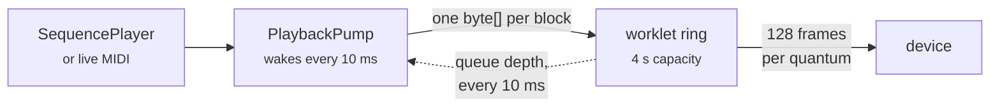

# In the browser

`src/TabulaSonora.Web` runs the whole engine client-side, as a standalone Blazor WebAssembly
application. Not a demo of it and not a thin remote control over a server: the same
[`ToneGenerator`](xref:TabulaSonora.Realtime.ToneGenerator) block loop the command line drives,
compiled to WebAssembly and rendering into a Web Audio worklet.

```
rm -rf src/TabulaSonora.Web/bin/Release/net10.0/publish
dotnet publish -c Release src/TabulaSonora.Web
```

Then serve `bin/Release/net10.0/publish/wwwroot` as static files. There is almost nothing to
configure — see *Two pages, one engine* below for the single thing there is. The delete matters:
`dotnet publish` writes new content-hashed assets without removing the old ones, so republishing over
the same directory leaves every previous generation sitting in `wwwroot` to be served alongside the
current one.

## Two pages, one engine

The application is two routes, because it is two instruments:

| | |
|---|---|
| `/` | the **player**: load a Standard MIDI File, drive the transport, mix it while it runs, render it to WAV |
| `/live` | the **instrument**: a controller or the on-screen keyboard, every sound the ROM holds, and the drum maps |

The split is not cosmetic: loading a file and driving a transport has nothing in common with
connecting a controller and playing, and each was burying the other's panels.

Nothing about the engine is routed. Every service is a singleton owned by the layout, so navigating
changes which panels are on screen and nothing else: the ROM stays loaded, a playing song keeps
playing, a held note keeps sounding. The one thing that *would* have broken is disposal — a page is
disposed on every navigation, so tearing the engine down in `Home.razor`'s `DisposeAsync` would have
meant the first click of the nav silencing the instrument. It lives in `MainLayout` instead.

**The one host requirement.** Two client-side routes and one file on disk: a reload on `/live`, or a
link straight to it, asks the server for a path that was never published. Every static host needs a
catch-all rewriting unknown paths to `index.html` with status **200** — `netlify.toml` carries one,
and `python3 -m http.server` does not, so a local deep-link check needs a host that does.

## The whole sound set

The live page browses what the loaded ROM actually contains, per vintage:
[`SoundCatalog`](xref:TabulaSonora.Patches.SoundCatalog) sweeps all 128 banks × 128 programs through
[`PatchDirectory`](xref:TabulaSonora.Patches.PatchDirectory) — the same calls the engine makes on a
program change, so there is no second lookup path to drift out of step — and reports each slot as one
of four things:

- **native**, defined by that bank, which a program change sounds;
- **capital fallback**, empty in that bank, where the module sounds bank 0's tone rather than falling
  silent (`Lut3Resolved`), so it is playable but is not the bank's own sound;
- **indirect-only**, carrying the `0x8000` marker;
- **unassigned**.

The browser is three Miller columns — vintage, then instrument, then variant — and that order is the
point. A bank is not a place a player goes to find a sound: most of its 128 slots are the capital tone
showing through, so browsing bank 8 means reading 128 entries of which a handful are its own. The
question worth asking is *which banks define a variation of this instrument*, and the answer is
usually two or three lines. The instrument column is the capital bank, which is the only one every
vintage fills completely, grouped by the sixteen General MIDI families — a layout of program numbers
from the spec, not from the ROM, so the names in it are still the vintage's own.

The bank counts are the vintages themselves: 15 for the SC-55, 24 for the SC-88, 45 for the SC-88Pro,
51 for the SC-8820. Not one indirect-only word is reachable from any of those four maps — the 1 164
in the table sit in LUT3 rows only `Dereference` visits, through an alternate-articulation entry
naming a map outside the selector. That is precisely why reading the word signed was a bug in the
dereference and invisible in a browse.

Drums do not work like this at all, and the page says so. A program change on the drum part does not
go through the three-level melodic lookup; it goes through the drum table's own pair, whose two map
rows are the same whichever vintage is selected. The module chooses between those rows from the
part's *internal* bank code, which is not reversed here, so
[`ToneGenerator.DrumMapRow`](xref:TabulaSonora.Realtime.ToneGenerator.DrumMapRow) is set by the host
instead — without it the second map's kits cannot be sounded at all.

The two rows are not abstract A and B. The set of programs row 0 defines is exactly the SC-8820's kit
list and row 1's is exactly the SC-88Pro's — established by comparing them against the plugin's own
per-vintage kit pages — with one addition each row carries and neither list mentions: the CM-64/32L
kit at program 128.

Keys are named from the melodic tone table, because drum sounds *are* melodic tones. Kit names are a
different matter: the DLL has none, and they live in the plugin's companion `SCVSC.drf`, which is
Roland's file and not this repository's to carry. So the page reads the user's own copy, optionally
and exactly as it reads the user's own DLL — without it, kits are known by the program that selects
them. Inventing "Room" or "Power" here would be writing down a name the application never found.

Banks **126 and 127** are not variations at all but the CM-64 compatibility map, so that a file
written for Roland's older Computer Music modules plays: 127 is the LA half (MT-32 / CM-32L) and 126
the PCM half (CM-32P). The ROM agrees with the documentation on both — bank 127's 128 programs carry
MT-32 tone names rather than Sound Canvas ones, and bank 126 holds exactly the CM-32P's 64 — and both
are identical across all four vintages, as a map belonging to no generation should be.

## Mixing while it plays

The mixer is sixteen live channel strips, and the two kinds of control on them behave differently on
purpose:

- **Mute and solo** go to [`ChannelMask`](xref:TabulaSonora.ChannelMask), which sits at the mix where
  no MIDI message reaches. They take effect on the next block, and nothing a file does can undo them.
- **The faders send Control Changes** — volume, pan, and the reverb and chorus sends. The engine has
  no other way in, and tracking the value behind its back would make a second source of truth for
  something the file also writes. So a running sequence overwrites a fader at its next controller
  event for that channel, exactly as it would on the module's own front panel.

A fader being dragged renders the value it last emitted rather than the part's. They are the same
number in the ordinary case, but not while a song is writing that controller too — and there,
redrawing the file's value into the control under the finger fights the drag.

## Fully client-side, in the strong sense

Standalone Blazor WebAssembly, not Blazor Server: the .NET runtime is compiled to WebAssembly and the
engine executes in the browser's sandbox. The published output is HTML, JavaScript, `.wasm` and the
assemblies — a plain static site, which is why `python3 -m http.server` is a sufficient host.

The application registers **no `HttpClient` at all**, so there is nothing it could call even by
accident. The user's DLL goes from the file picker into IndexedDB in JavaScript and reaches .NET only
inside the page; there is no upload path and no server to upload to.

## Publish it, do not run it

**`dotnet run` produces an application that cannot play in real time, and this is not a tuning
problem.** AOT compilation happens at publish, so a `dotnet run` build executes the DSP under the IL
interpreter — where it measures almost exactly **1× realtime**. The renderer and the music finish
neck and neck, polyphony tips the balance, and the audio device starves.

Published with AOT the same passage measures **tens of times realtime**, and the pump holds its full
one-second lead with no starved frames at all. That is the difference between an instrument and a
slideshow, so the project file turns `RunAOTCompilation` on for Release and the workload it needs is
a prerequisite rather than an optimisation:

```
dotnet workload install wasm-tools
```

How many tens depends entirely on the machine, so no single number belongs here as a property of the
engine. For scale: on a 24-core Windows desktop, Chrome, playing `canyon.mid` as SC-8820 with all
three effects on and peaking at 50 of the 64 voices, the median reading was **48×** — 32× through the
densest passage and over 100× through sparse ones, with no starved frames. A slower machine will read
lower and the ratio between passages will stay much the same. What matters is the margin over 1×, not
the figure.

The transport shows the measured figure beside the queue depth, precisely so this question never has
to be argued from impressions again. Below about 1.5× the reading turns amber.

## What the user has to supply

The engine is inert without `SCCore.dll`, and a web page cannot ship it. The application asks for it
once, verifies it against the pinned build, and keeps it in IndexedDB:

| | |
|---|---|
| first visit | full verification — size, PE timestamp and the whole SHA-256 |
| later visits | size and PE timestamp only, against the hash recorded when it was stored |

Re-hashing 27 MB on every page load would be a second of nothing happening, and the file cannot have
changed in storage without the record changing with it. The application also asks for
`navigator.storage.persist()`, without which a record that size is best-effort and can be evicted
under disk pressure — which would send the user back to the file picker with no explanation.

The bytes go from the picked file straight into IndexedDB in JavaScript and reach .NET exactly once,
as a stream reference read into a buffer sized from
[`TableManifest`](xref:TabulaSonora.Rom.TableManifest). They are never uploaded anywhere; there is
nowhere to upload them to.

[`RomImage.FromMemory`](xref:TabulaSonora.Rom.RomImage.FromMemory*) exists for this. A browser has no
filesystem to give [`RomImage.Open`](xref:TabulaSonora.Rom.RomImage.Open*) a path to, so the image
reads out of a `ReadOnlyMemory<byte>` instead; nothing downstream can tell the difference, and the
test suite asserts as much over every cached table and a slice of each wave-ROM bank.

## What else the browser remembers

Two preferences, both in `localStorage`, both tiny and neither derived from anything of Roland's: the
colour theme under `tabula-sonora.theme`, and the engine's vintage and three effect toggles under
`tabula-sonora.engine`. The second is written as `map,reverb,chorus,delay` — `3,1,1,0` is an SC-88Pro
with the delay off — and read back strictly, a value that does not parse in every field being
discarded whole rather than honoured in part.

**The default is the absence of an entry.** Neither key exists until the user chooses something other
than the default, "Restore defaults" removes the engine one again, and a value that stops parsing
falls back rather than failing. So a visitor who never opens either control leaves nothing behind,
and a change to what the defaults are reaches everyone who never overrode them. Storage access
*throws* where a browser has disabled it, and a remembered preference is not worth failing a page
over, so both directions swallow that and the page opens at its defaults instead.

The engine settings are restored in `Program.cs` before `RunAsync`, alongside the effect presets and
for a related reason: a DLL cached on a previous visit is loaded without asking, so applying the
vintage afterwards would build a generator at SC-8820 and immediately replace it. Restoring first
means the page opens in the remembered vintage rather than settling into it.

## Effects, and the one file that is shipped

The reverb and chorus coefficients are computed by the real engine at start-up and are stored nowhere
in the DLL. Harvesting them means executing a 64-bit Windows binary, which a browser cannot do under
any circumstances. So `presets.json` is committed and embedded in the web application's own
assembly — the one piece of Roland-derived data this repository carries, set out in `NOTICE.md`.

It is embedded in *this* assembly rather than the library's on purpose: a host that references
`TabulaSonora.dll` should not acquire Roland's data by accident. A user who has harvested their own
copy can upload it, and it takes precedence.

## Audio out

The engine renders at 32 kHz and the application asks the browser for an `AudioContext` at 32 kHz. On
a browser that agrees — and they generally do — **nothing resamples anywhere between the final mix and
the device**, which is the same property the desktop player gets by opening its device at the
engine's rate. Where the browser refuses, the worklet interpolates and the transport says
`(resampled)` beside the rate.

The audio thread cannot call into .NET, so nothing pulls blocks out of the engine. The pump pushes
them:



Two details that are load-bearing rather than incidental:

- **Blocks cross as a `byte[]`, not as two `float[]`.** Blazor marshals a `float[]` argument by
  serialising it to JSON, so pushing blocks the obvious way turns every sample into decimal text and
  parses it back — enough on its own to starve the device. Byte arrays have their own bulk transport.
- **The lead is 40 ms, for a song as well as for live playing.** A song used to run a full second
  ahead, on the reasoning that the only cost of a deep queue was a slower response to a seek and a
  seek flushes the queue anyway. That was incomplete: the mixer changes a channel *while* the song
  plays, so a second of queued audio is also a second before a fader is heard to move. What makes
  40 ms safe is that filling is driven by the worklet's report on the audio clock rather than by a
  timer the browser can delay — the queue only has to cover the render itself, not a missed wake-up.
  The starved-frame count and the realtime factor in the transport are how you would know it was too
  short.

The position shown is the audible one — the renderer's position less whatever is still queued.
Driving a progress bar from the renderer would show the song finishing a second before it is heard
to.

## One thread, which is the contract anyway

Blazor WebAssembly is single-threaded, so the pump, the UI events and the live MIDI callbacks all
arrive on the same thread. [`ToneGenerator`](xref:TabulaSonora.Realtime.ToneGenerator) documents
exactly that requirement — events and rendering from one thread — so the platform's limitation and
the engine's contract agree for free.
[`ChannelMask`](xref:TabulaSonora.ChannelMask) is the exception the library documents as safe to
change from anywhere, and the mixer changes it live with no rebuild and no gap.

Changing vintage or an effect toggle rebuilds the generator but **not** the
[`NoteRenderer`](xref:TabulaSonora.NoteRenderer): the tables are read once per session, and the
rebuild re-seeks to where the old generator was, so a vintage swap mid-song resumes rather than
restarting. What it cannot preserve is whatever was ringing.

## Exporting

The WAV export renders through a *second* generator over the same note renderer, so it neither
disturbs playback nor re-reads the tables, and it yields between quarter-second chunks so the page
stays alive and the progress bar means something.

It uses the block loop — the same path as `render --stream` — and the same
[`WavWriter`](xref:TabulaSonora.WavWriter). A file exported from the browser and one rendered on the
command line with matching settings are therefore expected to be *byte-identical*, not merely
similar, which makes the browser build checkable against the command line rather than only against
itself.
