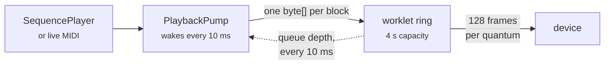

# In the browser

`src/TabulaSonora.Web` runs the whole engine client-side, as a standalone Blazor WebAssembly
application. Not a demo of it and not a thin remote control over a server: the same
[`ToneGenerator`](xref:TabulaSonora.Realtime.ToneGenerator) block loop the command line drives,
compiled to WebAssembly and rendering into a Web Audio worklet.

```
dotnet publish -c Release src/TabulaSonora.Web
```

Then serve `bin/Release/net10.0/publish/wwwroot` as static files. There is no back end and nothing to
configure.

## Fully client-side, in the strong sense

Standalone Blazor WebAssembly, not Blazor Server: the .NET runtime is compiled to WebAssembly and the
engine executes in the browser's sandbox. The published output is HTML, JavaScript, `.wasm` and the
assemblies — a plain static site, which is why `python3 -m http.server` is a sufficient host.

The application registers **no `HttpClient` at all**, so there is nothing it could call even by
accident. The user's DLL goes from the file picker into IndexedDB in JavaScript and reaches .NET only
inside the page; there is no upload path and no server to upload to.

## Publish it, do not run it

**`dotnet run` produces an application that cannot play in real time, and this is not a tuning
problem.** AOT compilation happens at publish, so a `dotnet run` build executes the DSP under the IL
interpreter — where it measures almost exactly **1× realtime**. The renderer and the music finish
neck and neck, polyphony tips the balance, and the audio device starves.

Published with AOT the same passage measures **10.9× realtime**, and the pump holds its full
one-second lead with no starved frames at all. That is the difference between an instrument and a
slideshow, so the project file turns `RunAOTCompilation` on for Release and the workload it needs is
a prerequisite rather than an optimisation:

```
dotnet workload install wasm-tools
```

The transport shows the measured figure — `10.9× realtime` beside the queue depth — precisely so this
question never has to be argued from impressions again. Below about 1.5× the reading turns amber.

## What the user has to supply

The engine is inert without `SCCore.dll`, and a web page cannot ship it. The application asks for it
once, verifies it against the pinned build, and keeps it in IndexedDB:

| | |
|---|---|
| first visit | full verification — size, PE timestamp and the whole SHA-256 |
| later visits | size and PE timestamp only, against the hash recorded when it was stored |

Re-hashing 27 MB on every page load would be a second of nothing happening, and the file cannot have
changed in storage without the record changing with it. The application also asks for
`navigator.storage.persist()`, without which a record that size is best-effort and can be evicted
under disk pressure — which would send the user back to the file picker with no explanation.

The bytes go from the picked file straight into IndexedDB in JavaScript and reach .NET exactly once,
as a stream reference read into a buffer sized from
[`TableManifest`](xref:TabulaSonora.Rom.TableManifest). They are never uploaded anywhere; there is
nowhere to upload them to.

[`RomImage.FromMemory`](xref:TabulaSonora.Rom.RomImage.FromMemory*) exists for this. A browser has no
filesystem to give [`RomImage.Open`](xref:TabulaSonora.Rom.RomImage.Open*) a path to, so the image
reads out of a `ReadOnlyMemory<byte>` instead; nothing downstream can tell the difference, and the
test suite asserts as much over every cached table and a slice of each wave-ROM bank.

## Effects, and the one file that is shipped

The reverb and chorus coefficients are computed by the real engine at start-up and are stored nowhere
in the DLL. Harvesting them means executing a 64-bit Windows binary, which a browser cannot do under
any circumstances. So `presets.json` is committed and embedded in the web application's own
assembly — the one piece of Roland-derived data this repository carries, set out in `NOTICE.md`.

It is embedded in *this* assembly rather than the library's on purpose: a host that references
`TabulaSonora.dll` should not acquire Roland's data by accident. A user who has harvested their own
copy can upload it, and it takes precedence.

## Audio out

The engine renders at 32 kHz and the application asks the browser for an `AudioContext` at 32 kHz. On
a browser that agrees — and they generally do — **nothing resamples anywhere between the final mix and
the device**, which is the same property the desktop player gets by opening its device at the
engine's rate. Where the browser refuses, the worklet interpolates and the transport says
`(resampled)` beside the rate.

The audio thread cannot call into .NET, so nothing pulls blocks out of the engine. The pump pushes
them:



Two details that are load-bearing rather than incidental:

- **Blocks cross as a `byte[]`, not as two `float[]`.** Blazor marshals a `float[]` argument by
  serialising it to JSON, so pushing blocks the obvious way turns every sample into decimal text and
  parses it back — enough on its own to starve the device. Byte arrays have their own bulk transport.
- **The lead is not one number.** A song runs a second ahead, because the only cost of a generous
  lead is a slower response to a seek and a seek flushes the queue anyway. Live playing runs 64 ms
  ahead, because there the lead *is* the latency between pressing a key and hearing it.

The position shown is the audible one — the renderer's position less whatever is still queued.
Driving a progress bar from the renderer would show the song finishing a second before it is heard
to.

## One thread, which is the contract anyway

Blazor WebAssembly is single-threaded, so the pump, the UI events and the live MIDI callbacks all
arrive on the same thread. [`ToneGenerator`](xref:TabulaSonora.Realtime.ToneGenerator) documents
exactly that requirement — events and rendering from one thread — so the platform's limitation and
the engine's contract agree for free.
[`ChannelMask`](xref:TabulaSonora.ChannelMask) is the exception the library documents as safe to
change from anywhere, and the mixer changes it live with no rebuild and no gap.

Changing vintage or an effect toggle rebuilds the generator but **not** the
[`NoteRenderer`](xref:TabulaSonora.NoteRenderer): the tables are read once per session, and the
rebuild re-seeks to where the old generator was, so a vintage swap mid-song resumes rather than
restarting. What it cannot preserve is whatever was ringing.

## Exporting

The WAV export renders through a *second* generator over the same note renderer, so it neither
disturbs playback nor re-reads the tables, and it yields between quarter-second chunks so the page
stays alive and the progress bar means something.

It uses the block loop — the same path as `render --stream` — and the same
[`WavWriter`](xref:TabulaSonora.WavWriter). A file exported from the browser and one rendered on the
command line with matching settings are therefore expected to be *byte-identical*, not merely
similar, which makes the browser build checkable against the command line rather than only against
itself.
